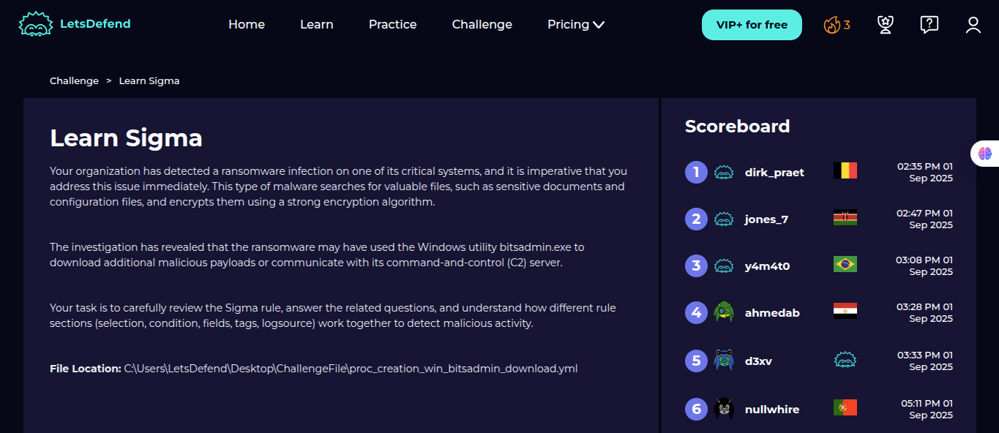
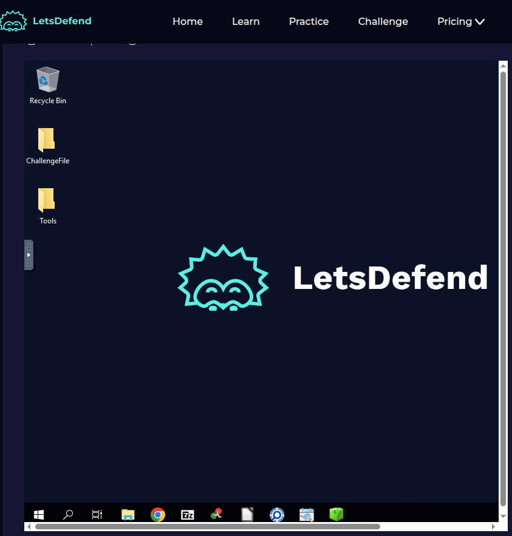
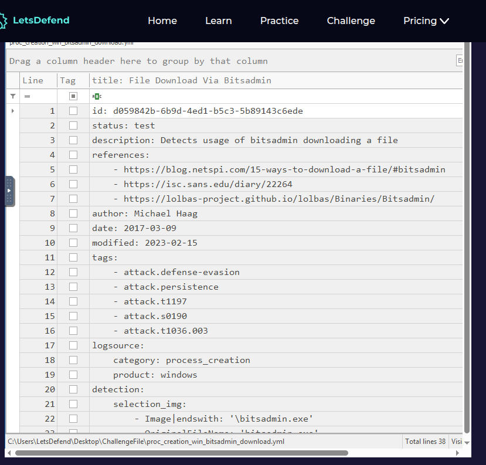
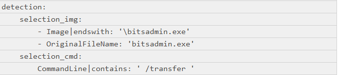
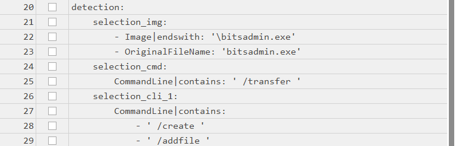
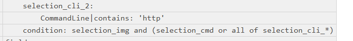
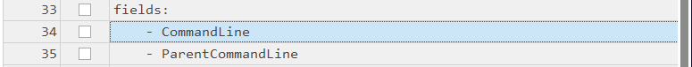
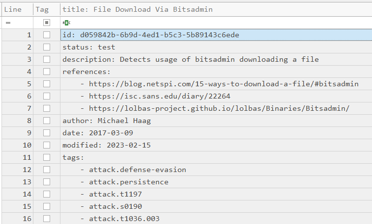
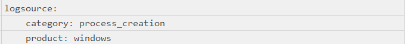

# LetsDefend-Sigma-Challenge
Detection engineering practice: Write-up and analysis of a LetsDefend challenge using a Sigma rule to detect ransomware activity leveraging bitsadmin.exe.
<br>
<br>
## 📌 Objective

Detect and analyze a ransomware infection that leveraged the Windows utility bitsadmin.exe to download additional malicious payloads, using a Sigma detection rule.
<br>
## 🧠 Skills Learned

- Understanding Sigma rules and their structure (selection, condition, tags, fields, log sources)

- Investigating ransomware behaviour with built-in Windows utilities

- Correlating malicious activity with command-and-control (C2) communication patterns

- Applying detection engineering concepts in a real-world SOC scenario
<br>

## 🛠 Tools Used

- LetsDefend Platform (challenge environment)

- Sigma Rules (YAML format)

- Windows Event Logs (proc_creation events)

- Text Editor (to review .yml rule file)

<br>

## 🔎 Steps Performed

1. Reviewed the challenge description: ransomware suspected of using bitsadmin.exe.
   

3. Located the Sigma rule file:
 ```
C:\Users\LetsDefend\Desktop\ChallengeFile\proc_creation_win_bitsadmin_download.yml
```

3. Analyzed the Sigma rule sections:

- Selection: defined suspicious process creation patterns involving bitsadmin.exe.

- Condition: combined selections to flag malicious usage.

- Tags & Fields: identified the rule’s focus on ransomware and C2 communications.

- Logsource: Windows process creation events.

4. Mapped how this rule would detect attempts by ransomware to use bitsadmin.exe for downloads.

5. Documented findings and uploaded screenshots for reference.

Explored the Lab Environment provided by LetsDefend


I used the Timeline Explorer for my findings


I discovered that the targeted executable file was the one targeted by the Sigma rule


The command line option used to indicate the file transfer in the Sigma rule


The logical expression in the condition field combined the criteria to trigger the Sigma rule


The specific field the Sigma rule captured shows the command being executed


The single ATT&CK tactic tag listed first in the Sigma rule


The primary category of events that this Sigma rule was written to monitor


The specific command line argument the Sigma rule looked for to identify the HTTP-based downloads


The command line that miust be present to create a new transfer using bitsadmin


